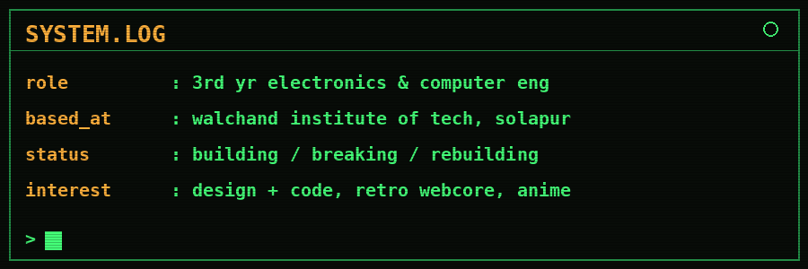

<div align="center">



</div>

### `~/projects`

- **AgriPulse** — IoT onion storage monitor (Arduino, DHT-11, MQ-135, Firebase) — 2nd place @ Tech Nirman 1.0

### `~/stack`

<div align="center">


</div>

### `~/stats`

<div align="center">


</div>

### `~/metrics`

<div align="center">


</div>

### `~/commit-calendar`

<div align="center">



</div>

### `~/connect`

<div align="center">

[](https://www.linkedin.com/in/suneja-mhanta-b551a737a)
[](https://pin.it/Yy2rGXqhQ)
[](https://unstop.com/u/sunejmha57111)

</div>

<div align="center">

```
> end of file_
```

</div>

